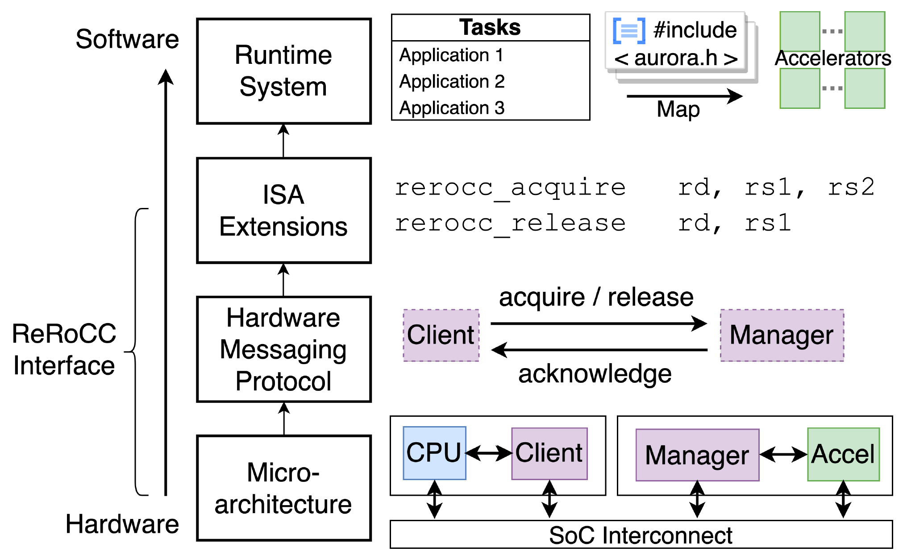
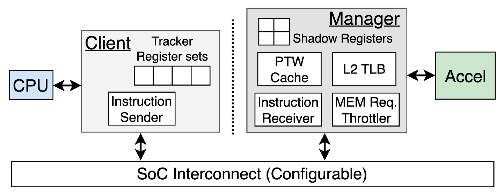

# AuRORA: Virtualized Accelerator Orchestration for Multi-Tenant Workloads

| This is an archival of the AuRORA (MICRO 2023) Chipyard artifact. |
|-----|

## Quick Links

* **MICRO2023 [paper](https://people.eecs.berkeley.edu/~ysshao/assets/papers/aurora-micro2023.pdf)**
* **Up-to-date version of ReRoCC interface [repo](https://github.com/ucb-bar/rerocc/tree/master)**
* **Top level FireSim: [repo](https://github.com/SeahK/firesim-aurora-ae/tree/main), [zenodo](https://zenodo.org/records/8354298)**
* **Submodules (Zenodo): [chipyard](https://zenodo.org/records/8354250), [accelerator HW](https://zenodo.org/records/8354236), [SW](https://zenodo.org/records/8354218)**

This repository corresponds to submodule "chipyard" as ReRoCC AE version implements here.


## What is AuRORA

AuRORA is a novel full-stack accelerator integration methodology that enables scalable multi-accelerator deployment for multi-tenant workloads.
AuRORA supports virtualized accelerator orchestration through co-designing the hw-sw stack of accelerator allow adaptively binding the workloads into  accelerators.
AuRORA consists of [ReRoCC](https://github.com/ucb-bar/rerocc) (remote RoCC), a virtualized and disaggregated accelerator interface for many-accelerator integration, and a runtime system for adaptive accelerator management.
Similar to virtual memory to physical memory abstraction, AuRORA provides an abstraction between user's view of accelerator and the physical accelerator instances.
AuRORA's virtualized interface allows workloads to be flexibly and dynamically orchestrated to available accelerators based on their latency requirement, regardless of the physical accelerator instances' location.
To effectively support virtualized accelerator orchestration, AuRORA delivers a full-stack solution that co-designs the HW and SW layers, with the goal of delivering scalable performance for multi-accelerator systems. 



From bottom to top, AuRORA full-stack includes:
* Low-overhead shim microarchitecture to interface between cores and accelerators.
* Hardware messaging protocol between core and accelerators to enable scalable and virtualized accelerator deployment on SoC.
* ISA extension to allow user threads to interact with AuRORA hardware in a programmable fashion.
* Lightweight software runtime to dynamically reallocate resources for multi-tenant workloads.

Please refer to our [paper](https://people.eecs.berkeley.edu/~ysshao/assets/papers/aurora-micro2023.pdf) for details.

## AuRORA Microarchitecture
AuRORA microarchitecture component consists of ``Client`` and ``Manager``. 
``Client`` integrates with the host general-purpose cores. It allows communication to and from disaggregated accelerators and provide illusion of tight-coupling. 
``Manager`` wraps an existing accelerators. It includes PTW and L2 TLB which are compliant to accelerator MMU. It implements a shadow copy of architectural CSRs used by accelerator MMU.



## AuRORA ISA
AuRORA includes 5 ISAs, which are ``rerocc_acquire`` and ``rerocc_release`` to acquire and release the accelerator, ``rerocc_assign`` to map acquired accelerator to available opcode, ``rerocc_fence`` to fence memory between core memory and acquire accelerator if needed, and ``rerocc_memrate`` for memory rate partitioning.
This [file](https://github.com/SeahK/chipyard-aurora-ae/blob/main/tests/rerocc.h) contains ISA sets used.

## SoC integration
AuRORA supports both crossbar and NoC integration for protocol transport. This can be shared with on-chip memory interconnect, or can be configured as a separate interconnect. 
Please refer to the SoC [Configs](https://github.com/ucb-bar/AuRORA/blob/008723ead6425e6252f3101893a7978c07fd7328/generators/chipyard/src/main/scala/config/NoCConfigs.scala#L220) how we configured NoC and crossbar SoC.

## AuRORA Runtime
AuRORA runtime is implemented in [gemmini tests](https://github.com/SeahK/aurora-rocc-tests-ae/tree/main) for convenience as we use Gemmini DNN accelerator generator for evaluation. 

## Citing AuRORA
If AuRORA helps you in your research, you are encouraged to cite our paper. Here is an example bibtex:

```BibTex
@inproceedings{
  aurora,
  title={AuRORA: Virtualized Accelerator Orchestration for Multi-Tenant Workloads},
  author={Seah Kim and Jerry Zhao and Krste Asanovic and Borivoje Nikolic and Yakun Sophia Shao},
  booktitle={IEEE/ACM International Symposium on Microarchitecture (MICRO)},
  year={2023}
}
```

## ToDo
This is the repository for AE. We are in the process of making a clean version of the repository with simpler examples. We also have ongoing improvements/updates in the ReRoCC interface, and we will be incorporating those in the update.

## Other Useful Resources

### Using Chipyard
To learn about using Chipyard, see the documentation on the Chipyard documentation site: https://chipyard.readthedocs.io/

### Using FireSim
To learn about using FireSim, you can find the documentation and getting-started guide at
[docs.fires.im](https://docs.fires.im). 

### Using Gemmini
To learn about using Gemmini, visit Gemmini [repository](https://github.com/ucb-bar/gemmini/tree/dev).

